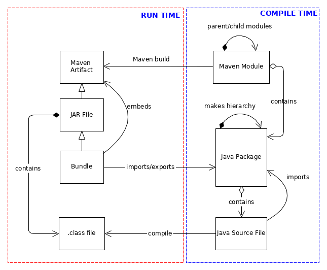

# Bundles
* Bundles are the unit of modularity in OSGi
* A bundle is just a JAR file with special headers in its `MANIFEST.MF` file
* As files, bundles are physical modules. Bundles can be moved or copied. Contrast with packages, which are logical modules.

## Grouping Things: modules, bundles, packages, and artifacts
* Modules - Maven compile-time construct
* Artifacts - Maven run-time construct
* Packages - Java compile-time construct
* JARs - JRE run-time construct
* Bundles - OSGi run-time construct

These constructs have a loose relationship to each other. If I had to draw a UML diagram of it, it would look like this:

* JAR files are a kind of Maven artifact
* Bundles are a kind of JAR file
* Bundles can import, export Java packages
* Bundles can embed artifacts like JAR files
* Maven builds modules into artifacts
* Maven modules can contain multiple packages
* Maven modules can be nested
* Packages can import classes from other packages
* Java source files are .java files
* .class files are binary and contain the byte codes for the JVM
* Classes belong to a package

## Bundle Lifecycle
